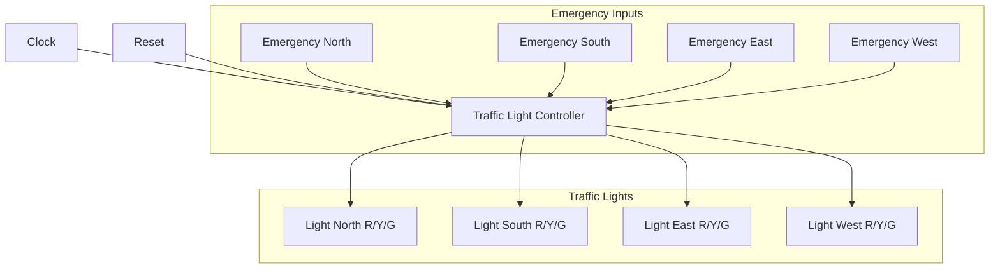
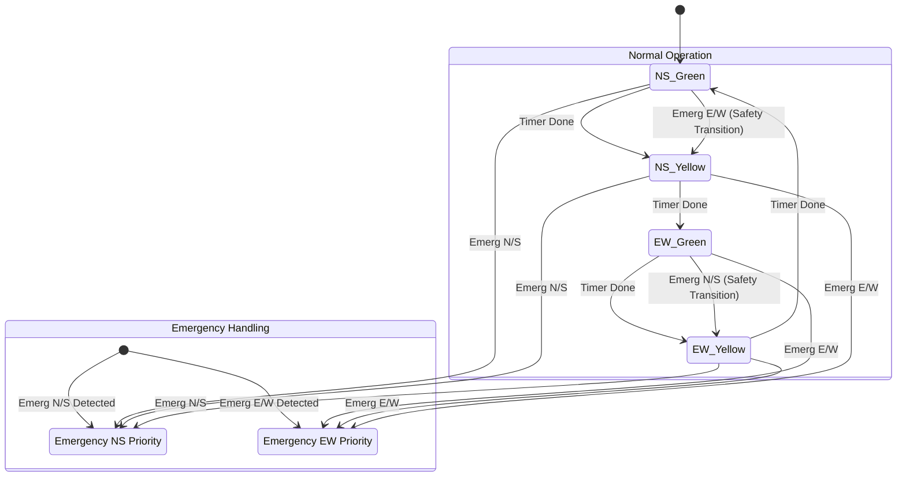

# Traffic Light Controller with Emergency Vehicle Priority

## Project Overview
This project implements a Traffic Light Controller in Verilog for a 4-way intersection. It features a standard Green-Yellow-Red cycle and a priority mechanism for emergency vehicles (Ambulance, Fire Truck, Police Car).

## Features
- **4-Way Control**: Independently controls North, South, East, and West lights.
- **Emergency Override**: Detects emergency vehicles from any direction and safely transitions the lights to give them priority.
- **Visualization**: The simulation outputs a visual ASCII representation of the intersection state.

## How to Run
Prerequisite: `iverilog` (Icarus Verilog) must be installed.

1.  Navigate to the project directory:
    ```bash
    cd TrafficLightController
    ```
2.  Run the simulation script:
    ```bash
    ./run_sim.sh
    ```
3.  View the output in the console.

### Web Interface (Cyberpunk Edition)
To run the interactive web interface with real-time graphs:
1.  Run the web app script:
    ```bash
    ./run_web.sh
    ```
2.  Open your browser at `http://localhost:5000`.
3.  Use the control panel to toggle emergency vehicles and watch the system respond in real-time.

## Pictorial Representation

### System Architecture


### Finite State Machine (FSM) Diagram


## Simulation Output Example
The simulation will print the status of the lights like this:
```text
Time: 1035000 ns
      N: [G]
W: [R]       E: [R]
      S: [G]
---------------------
```
